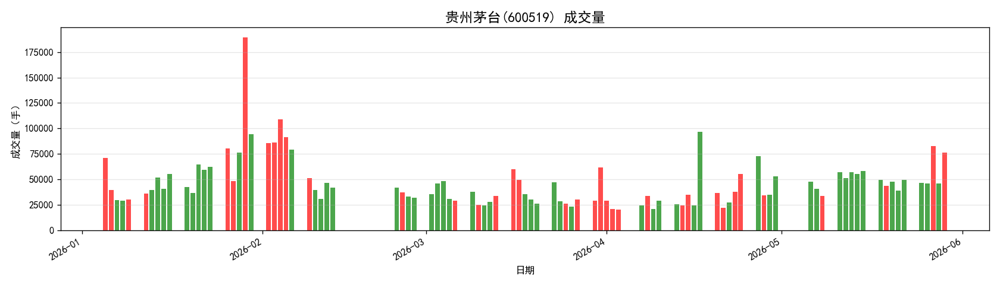
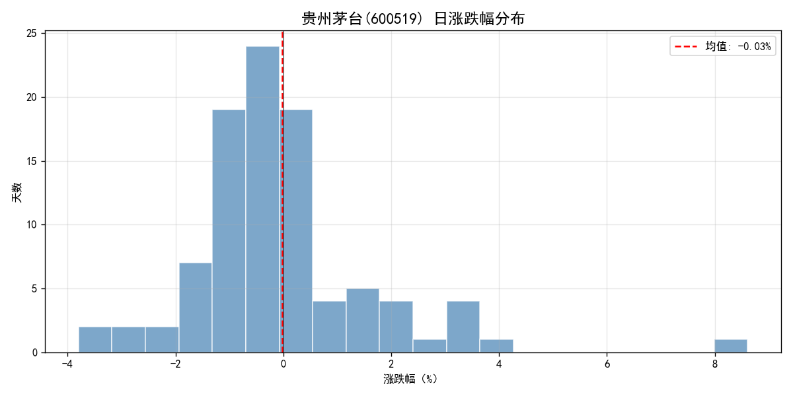
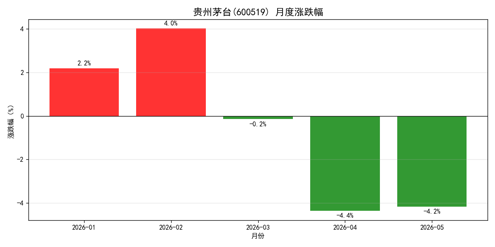

# A股个股分析：贵州茅台(600519)

## 项目简介

基于 akshare 获取贵州茅台2026年A股日线数据，使用 pandas 进行数据清洗
与指标计算，matplotlib 完成可视化分析，并将数据存入 MySQL 进行查询分析。

## 技术栈

- Python 3.x
- akshare：股票数据获取
- pandas / numpy：数据处理与指标计算
- matplotlib：数据可视化
- MySQL + pymysql：数据存储与查询

## 分析内容

- 收盘价走势与5日、20日均线
- 成交量涨跌分布
- 日涨跌幅分布（均值约-0.03%）
- 月度涨跌幅统计

## 核心指标

- 数据区间：2026-01-05 至 2026-05-29，共95个交易日
- 最大回撤：-18.11%（发生于2026-05-26）
- 日均涨跌幅：-0.03%
- 2月成交量异常放大，为全年最高峰

## 可视化结果

## 快速开始

pip install -r requirements.txt

修改 notebooks/analysis.ipynb 中的数据库密码后运行即可。

## 数据来源

[akshare](https://akshare.akfamily.xyz/) 开源财经数据接口